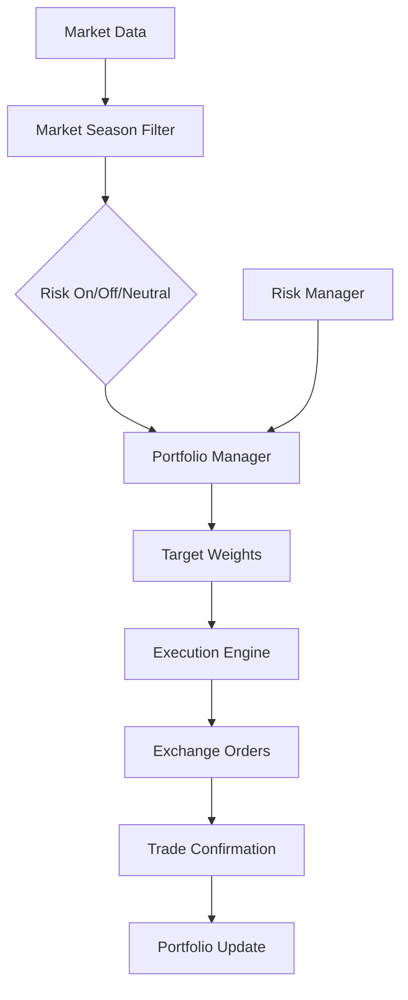
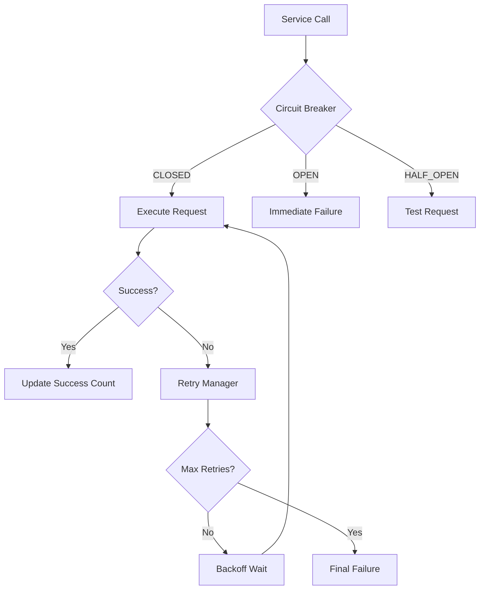

# KAIROS-1 Architecture Documentation

## 시스템 개요

KAIROS-1은 암호화폐 자동 투자를 위한 고성능, 고가용성 시스템입니다. 시장 계절을 분석하여 동적으로 포트폴리오를 리밸런싱하고, 다양한 리스크 관리 기법을 통해 안정적인 수익을 추구합니다.

## 아키텍처 원칙

### 1. 모듈화 (Modularity)
- 각 모듈은 단일 책임 원칙을 따름
- 느슨한 결합과 높은 응집도
- 독립적인 테스트와 배포 가능

### 2. 확장성 (Scalability)
- 비동기 처리를 통한 고성능 구현
- 마이크로서비스 아키텍처 준비
- 수평 확장 가능한 설계

### 3. 안정성 (Reliability)
- 서킷 브레이커 패턴
- 재시도 로직과 백오프 전략
- 포괄적인 에러 처리

### 4. 보안 (Security)
- 암호화된 비밀 정보 관리
- API 키 로테이션 지원
- 접근 감사 로깅

## 시스템 구조

```
┌─────────────────────────────────────────────────────────────┐
│                    KAIROS-1 System                          │
├─────────────────────────────────────────────────────────────┤
│  ┌─────────────┐  ┌─────────────┐  ┌─────────────┐         │
│  │     CLI     │  │  REST API   │  │  WebSocket  │         │
│  │ Interface   │  │   Server    │  │   Server    │         │
│  └─────────────┘  └─────────────┘  └─────────────┘         │
├─────────────────────────────────────────────────────────────┤
│                 Service Layer                               │
│  ┌─────────────┐  ┌─────────────┐  ┌─────────────┐         │
│  │ Portfolio   │  │    Risk     │  │ Execution   │         │
│  │  Manager    │  │  Manager    │  │   Engine    │         │
│  └─────────────┘  └─────────────┘  └─────────────┘         │
├─────────────────────────────────────────────────────────────┤
│                  Core Layer                                 │
│  ┌─────────────┐  ┌─────────────┐  ┌─────────────┐         │
│  │   Market    │  │  Analysis   │  │ Backtesting │         │
│  │   Filter    │  │   Engine    │  │   Engine    │         │
│  └─────────────┘  └─────────────┘  └─────────────┘         │
├─────────────────────────────────────────────────────────────┤
│                Infrastructure Layer                         │
│  ┌─────────────┐  ┌─────────────┐  ┌─────────────┐         │
│  │  Exchange   │  │  Database   │  │ Monitoring  │         │
│  │   Client    │  │  Manager    │  │   System    │         │
│  └─────────────┘  └─────────────┘  └─────────────┘         │
└─────────────────────────────────────────────────────────────┘
```

## 주요 컴포넌트

### 1. Core Layer

#### Portfolio Manager (`src/core/portfolio_manager.py`)
- **책임**: 포트폴리오 구성 및 리밸런싱 로직
- **주요 기능**:
  - 자산 배분 계산
  - 리밸런싱 신호 생성
  - 포트폴리오 성과 추적
- **의존성**: Market Filter, Risk Manager

```python
class PortfolioManager:
    async def calculate_target_weights(
        self, 
        market_season: MarketSeason,
        risk_level: RiskLevel
    ) -> Dict[AssetSymbol, Percentage]:
        """시장 상황과 리스크 수준에 따른 목표 비중 계산"""
```

#### Market Season Filter (`src/core/market_season_filter.py`)
- **책임**: 시장 계절 판단
- **주요 기능**:
  - 기술적 지표 분석
  - 시장 상황 분류 (Risk On/Off/Neutral)
  - 신호 안정성 확보를 위한 필터링
- **의존성**: Price Provider

#### Dynamic Execution Engine (`src/core/dynamic_execution_engine.py`)
- **책임**: 지능형 주문 실행
- **주요 기능**:
  - TWAP (Time-Weighted Average Price) 실행
  - 슬리피지 최소화
  - 시장 충격 완화
- **의존성**: Exchange Client

### 2. Security Layer

#### Secrets Manager (`src/security/secrets_manager.py`)
- **책임**: 민감한 정보의 안전한 관리
- **주요 기능**:
  - 암호화된 저장
  - 키 로테이션
  - 접근 감사
- **보안 특징**:
  - AES-256 암호화
  - PBKDF2 키 유도
  - 메모리 내 암호화 상태 유지

### 3. Resilience Layer

#### Circuit Breaker (`src/core/resilience.py`)
- **책임**: 장애 전파 방지
- **상태**: CLOSED → OPEN → HALF_OPEN
- **설정 가능 파라미터**:
  - 실패 임계값
  - 타임아웃 시간
  - 성공 임계값

#### Retry Manager (`src/core/resilience.py`)
- **책임**: 재시도 로직 관리
- **백오프 전략**:
  - Fixed: 고정 지연
  - Linear: 선형 증가
  - Exponential: 지수 증가
  - Fibonacci: 피보나치 수열
  - Random: 랜덤 지터

### 4. Performance Layer

#### Async HTTP Client (`src/core/async_client.py`)
- **책임**: 고성능 HTTP 통신
- **주요 기능**:
  - 연결 풀링
  - 자동 캐싱
  - 배치 처리
  - Rate Limiting

### 5. Data Layer

#### Database Manager (`src/utils/database_manager.py`)
- **책임**: 데이터 지속성 관리
- **지원 기능**:
  - SQLite 기반 로컬 저장
  - 자동 백업
  - 데이터 무결성 검증

## 데이터 플로우

### 1. 포트폴리오 리밸런싱 플로우



### 2. 에러 처리 플로우



## 설정 관리

### 계층적 설정 구조

```yaml
# config/base.yaml
system:
  name: "KAIROS-1"
  version: "1.0.0"
  environment: "production"

trading:
  enabled: true
  dry_run: false
  max_slippage: 0.005  # 0.5%

portfolio:
  core_assets: ["BTC", "ETH"]
  satellite_assets: ["XRP", "SOL"]
  rebalance_frequency: "monthly"

risk:
  max_drawdown: 0.20  # 20%
  max_position_size: 0.40  # 40%
  stop_loss_threshold: 0.15  # 15%
```

### 환경별 오버라이드

```yaml
# config/development.yaml
trading:
  dry_run: true

logging:
  level: "DEBUG"

# config/production.yaml
trading:
  dry_run: false

logging:
  level: "INFO"
```

## 모니터링 및 관측성

### 1. 메트릭

```python
# 성능 메트릭
response_time_histogram
request_count_counter
error_rate_gauge

# 비즈니스 메트릭
portfolio_value_gauge
daily_return_histogram
drawdown_gauge
trade_count_counter
```

### 2. 로깅

```python
# 구조화된 로깅
logger.info("포트폴리오 리밸런싱 시작", extra={
    "event_type": "rebalance_start",
    "portfolio_value": 10000000,
    "target_weights": {"BTC": 0.3, "ETH": 0.2, "KRW": 0.5},
    "market_season": "risk_on"
})
```

### 3. 알림

```python
# 중요 이벤트 알림
class AlertManager:
    async def send_alert(self, level: AlertLevel, message: str, details: Dict):
        # Slack, Discord, Email 등 다중 채널 지원
        pass
```

## 배포 아키텍처

### 1. 로컬 배포 (Single Instance)

```
┌─────────────────────┐
│    KAIROS-1 App     │
│  ┌───────────────┐  │
│  │   Main App    │  │
│  │   + Services  │  │
│  └───────────────┘  │
│  ┌───────────────┐  │
│  │  SQLite DB    │  │
│  └───────────────┘  │
└─────────────────────┘
```

### 2. 분산 배포 (Multi-Instance)

```
┌─────────────┐    ┌─────────────┐    ┌─────────────┐
│  Instance 1 │    │  Instance 2 │    │  Instance 3 │
│ (Portfolio) │    │   (Risk)    │    │ (Execution) │
└─────────────┘    └─────────────┘    └─────────────┘
       │                   │                   │
       └───────────────────┼───────────────────┘
                           │
               ┌─────────────────┐
               │  Shared Redis   │
               │   + Database    │
               └─────────────────┘
```

## 성능 최적화

### 1. 메모리 최적화
- 지연 로딩 (Lazy Loading)
- 객체 풀링
- 캐시 LRU 정책

### 2. I/O 최적화
- 비동기 처리
- 연결 풀링
- 배치 처리

### 3. CPU 최적화
- 알고리즘 최적화
- 병렬 처리
- 프로파일링 기반 최적화

## 보안 아키텍처

### 1. 데이터 보호
```
┌─────────────┐ Encrypt  ┌─────────────┐ Network  ┌─────────────┐
│ Application │ ───────→ │    File     │ ───────→ │  Exchange   │
│    Data     │   AES    │   System    │   TLS    │     API     │
└─────────────┘          └─────────────┘          └─────────────┘
```

### 2. 접근 제어
- API 키 기반 인증
- 역할 기반 권한 관리
- 감사 로깅

### 3. 네트워크 보안
- TLS 1.3 강제 사용
- 인증서 고정 (Certificate Pinning)
- IP 화이트리스트

## 확장성 고려사항

### 1. 수평 확장
- 상태 비저장 서비스 설계
- 로드 밸런싱
- 분산 캐시

### 2. 수직 확장
- 멀티스레딩
- 메모리 최적화
- CPU 집약적 작업 최적화

### 3. 데이터베이스 확장
- 읽기 복제본
- 샤딩
- 파티셔닝

## 테스트 전략

### 1. 단위 테스트
- 각 함수/메서드별 테스트
- Mock 객체 활용
- 90% 이상 코드 커버리지 목표

### 2. 통합 테스트
- 컴포넌트 간 상호작용 테스트
- 실제 API 호출 테스트
- 데이터베이스 트랜잭션 테스트

### 3. 성능 테스트
- 부하 테스트
- 스트레스 테스트
- 지연 시간 측정

### 4. 보안 테스트
- 취약점 스캔
- 침투 테스트
- 민감 데이터 노출 검사

## 장애 복구

### 1. 백업 전략
- 자동 데이터 백업
- 설정 파일 백업
- 로그 아카이빙

### 2. 복구 절차
- 데이터 복구 스크립트
- 서비스 재시작 자동화
- 롤백 메커니즘

### 3. 고가용성
- 헬스체크
- 자동 장애조치
- 서킷 브레이커

이 아키텍처는 KAIROS-1 시스템의 현재 상태와 미래 확장 계획을 반영하며, 지속적인 개선과 최적화를 통해 발전시켜 나갈 예정입니다.